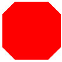
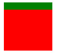
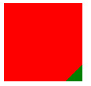
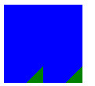
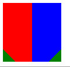

###切角效果

首先来看看切角效果图，留个直观印象。



要实现这个效果肯定要用到渐变，我们先想想如何利用渐变先切出一个角。
```css
linear-gradient(green 15px,red 0)
```


以上是liner-gradient最基本的用法，现在我们来旋转一下。
```css
linear-gradient(-45deg;green 15px,red 0);

```
看看效果



我们只需要把绿色改成transparent就可以实现切出一个角的效果，下面我们用同样的方法看能不鞥切出两个角。我们知道线性渐变实际产生的
是背景图片，那么我们就可以利用多层线性渐变来做。于是我们这样写：
```css
	width: 100px;
	height: 100px;
	background: 
	linear-gradient(-45deg,green 15px,red 0),
	linear-gradient(45deg,green 15px,blue 0);
```
我们会发现没有任何效果，那是因为会产生覆盖，所以办法就是将每层渐变都缩小一些，就是利用background-size然后利用background-position
来进行定位。
```css
	width: 100px;
	height: 100px;
	background: 
	linear-gradient(-45deg,green 15px,blue 0) right,
	linear-gradient(45deg,green 15px,red 0) left;
	background-size: 50% 100%;
```


我们可以发现，并不是我们想的那样，那是因为我们没有加`background-repeat:no-repeat`；导致重合了,加上之后可以看看



既然已经写出了两个切角，那么四个切角当然也不再话下。

```css
	width: 100px;
	height: 100px;
	background: 
	linear-gradient(-45deg,transparent 15px,red 0) bottom right,
	linear-gradient(45deg,transparent 15px,red 0) bottom left,
	linear-gradient(-135deg,transparent 15px,red 0) top right,
	linear-gradient(135deg,transparent 15px,red 0) top left;
	background-size: 50% 50%;
	background-repeat: no-repeat;
```
效果图自己脑补，其实利用这些知识还可以绘制出其他形状哦，我们来看看这是我灵机发挥的

```css
width: 200px;
height: 200px;
background: lightblue;
background: 
            linear-gradient(135deg ,transparent 25%,red 0) 0 0,
            linear-gradient(-145deg,transparent 40%,red 0) 50px 0,
            linear-gradient(145deg,transparent 40%,red 0)  100px 0,
            linear-gradient(-135deg,transparent 15px,red 25%) 150px 0,
       
            linear-gradient(red 15px,red 0) 0 50px,
            linear-gradient(red 15px,red 0) 50px  50px,
            linear-gradient(red 15px,red 0)  100px 50px,
            linear-gradient(red 15px,red 0) 150px 50px,
            
            linear-gradient(45deg,transparent 50%,red 0) 0 100px ,
            linear-gradient(red 15px,red 0) 50px 100px ,
            linear-gradient(red 15px,red 0)  100px 100px ,
            linear-gradient(-45deg,transparent 50%,red 0) 150px 100px ,
            
            linear-gradient(45deg,transparent 50%,red 0)  50px 150px ,
            linear-gradient(-45deg,transparent 50%,red 0) 100px 150px ;
           
background-size: 25% 25%;
background-repeat: no-repeat;
```


可能并不好看，但是这是一个思路。当然还可以做黑白块交错的背景等等。

