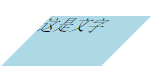
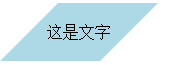
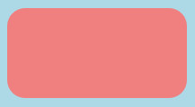

###平行四边形

当我们绘制平行四边形时，一定会想到的就是transform:skew()这个属性。但是按照一般的方法我们会如下写。

```html
<div class="demo1">
	这是文字
</div>
```

```css
.demo1{
	width: 100px;
	height: 50px;
	background: lightblue;
	transform: skewX(-45deg);
}
```



但是我们会发现，内容也会变形，这并不是我们想看到的结果。于是我们可以利用伪元素来做。
```css
.demo2{
	width: 100px;
	padding: 20px 0;
	text-align: center;
	position: relative;
	
	
}

.demo2:before{
	content: "";
	position: absolute;
	z-index: -1;
	top: 0;
	bottom: 0;
	left: 0;
	right: 0;
	background: lightblue;	
	transform: skewX(-45deg);			
}
```


利用伪元素就可以实现，因为文字并不在伪元素中，所以不会产生倾斜。当然伪元素还可以做很多事情

1 产生多层背景  [参考链接](http://nicolasgallagher.com/multiple-backgrounds-and-borders-with-css2/demo/backgrounds.html)

2 绘制边框内圆角的效果

```css
.demo2{
	width: 200px;
	height: 100px;
	background: lightcoral;
	border-radius: 20px;
	outline: 10px solid lightblue;
	position: relative;
	
	
}

.demo2:after{
	content: "";
	position: absolute;
	top: 0;
	bottom: 0;
	left: 0;
	right: 0;
	z-index: -1;
	background: lightblue;
}
```



当然这一效果还有其他方式可以实现（box-shadow）。[参考链接](http://www.cnblogs.com/djlxs/p/6038988.html)

